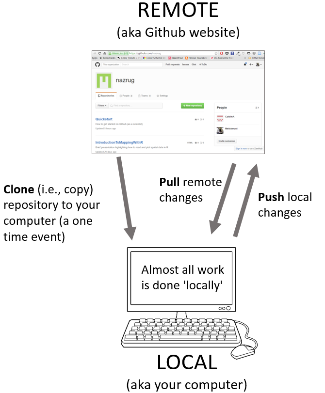

# What is Git/Github?

**Git**: Open source distributed version control system....

**GitHub**: Web-based Git repository hosting service

From here on, I will just refer to Github.

# Why Git/Github can be confusing for scientists
Github was developed for social coding (i.e., sort of like an open source Wikipedia for programmers). Consequently, much of the functionality and terminology of Github (e.g., branches and pull requests) isn't necessary for a scientist getting started.  

These concepts are more important for coders who want the entire coding community (and not just people working on the same project) to be able to suggest changes to their code.  This isn't how most scientists will use Github.  

To get the full functionality of Github, you will eventually want to learn other concepts.  But, this can wait.  

**Goals**: 

1. Only introduce the features and terminology that scientists need to learn in order to begin managing their projects.

2. Demonstrate a workflow using R, RStudio, and Github.

# Why should scientists use Github?

1. Ends (or, nearly ends) the horror of keeping track of versions.
  Basically, we go from this: 
 
 

 
 
To this:
 
 

 
 
When you open your respository, you only see the most recent version.  But, it easy to compare versions, and you can easily revert to previous versions. 
 
 
2. Improves collaborative efforts.  Different researchers can work on the same files at the same time!
3. It is easy to share and distribute files through the Github website.
4. Your files are available anywhere!  Once I forgot my powercord while traveling and couldn't use my computer.  I was able to work from another computer and had access to all my work!  

# Getting started

You will need to:

1. create a [Github account](https://github.com)  
2. install the [Git software](https://git-scm.com/downloads) on your computer (there are good instructions for installing these programs [here, Section 5.1](http://ohi-science.org/manual/#toolbox-software))
3. install [R](https://cran.r-project.org/) and [RStudio](https://www.rstudio.com/products/RStudio/). 

I only interact with Github through RStudio.  There is also a stand-alone Git Gui, but I have never actually used it. 

All three programs will need to be talking to each other.  Usually this magically happens, but sometimes trouble shooting is required.  Here is some information about fixing [common errors](http://ohi-science.org/manual/#toolbox-troubleshooting). 

> If you are a student you can get the micro account which includes 5 private repositories for free (normally a $7/month value).  You can sign up for the student account [here](https://education.github.com/pack).  Instructors can also request a free organization [account, "Request a discount"](https://education.github.com/).

# Some Github terminology

* **Organization**: The Github account (e.g., nazrug).
* **Repository**: A folder within the organization that includes files dedicated to a project.
* **Local Github**: Copies of Github files located your computer.
* **Remote Github**: Github files lcoated on the https://github.com website.
* **Clone**: Process of making a local copy of a remote Github repository.  This only needs to be done once (unless you mess up your local copy).
* **Pull**: Copy changes on the remote Github repository to your local Github repository.  This is useful if multiple people are making changes to a repository.
* **Push**: Save local changes to remote Github
 
 

 
 

# Create a repository on your Github account

### Step 1
 
 

 
 

### Step 2
 
 

 
 

The *Add gitignore* option adds a document where you can identify files or file-types you want Github to ignore. These files will stay in on the local Github folder (the one on your computer), but will not be uploaded onto the web version of Github.

The *Add a license* option adds a license that describes how other people can use your Github files (e.g., open source, but no one can profit from them, etc.).  This usually isn't something you need to worry about.
Our new repository!  

Notice how the README.md file we created is automatically displayed at the bottom.
 
 

 
 

# From here, you will work locally (on your computer)

## Clone your repository
This copies the Remote repository on Github.com to your local computer.

### Step 1
Copy the web address of the repository you want to clone:
 
 

 
 

And, then, from RStudio:
 
 

### Step 2

 
 

### Step 3

 
 

 
 

### Step 4

 
 

 
 

### Step 5

 
 

 
 

If everything went well, the repository will be added to the list located here:

 
 

And the repository will be saved to the Github folder on your computer:
 
 

 
 

Ta da!!!!  The folder doesn't contain much of interest, but we are going to change that.

# Add files to local Github folder and save to remote Github

The repository will contain:

* .gitignore file
* README.md
* Rproj

And, I typically create the following:

* folders for "data" and "figures"  
* R scripts
* etc.

To make changes to the repository, you will work from your computer ("local Github").

When files are changed in the local repository, these changes will be reflected in the Git tab of RStudio:
 
 

 
 

These are the codes RStudio uses to describe how the files are changed, (from the RStudio [cheatsheet](http://www.rstudio.com/wp-content/uploads/2016/01/rstudio-IDE-cheatsheet.pdf)):

When you are ready to commit your changes, you follow these steps:
 
 

 
 

We walk through this process below:

### Pull 
From the Git tab, "Pull" the repository.  This makes sure your local repository is synced with the remote repository.  This is very important if other people are making changes to the repository or if you are working from multiple computers.
 
 

 
 

### Stage
Stage the files you want to commit.  In RStudio, this involves checking the "Staged" boxes:
 

 
 

### Commit
 

 
 

### Push
 

 

### Check remote Github
The files you added should be on github.com:
 

 
 

# Tracking changes in your files
Whenever you make changes to the files in Github, you will walk through the Pull -> Stage -> Commit -> Push steps.

I tend to do this every time I finish a task (basically when I start getting nervous that I will lose my work).  Once something is committed, it is very difficult to lose it.

One thing that I love about about Github is that it is easy to see how files have changed over time.  Usually I compare commits through github.com:
 
 

 
 
 
 

 
 

You can click on the commits to see how the files changed from the previous commit:
 
 

 
 

# The README.md
The README file is a markdown file.  

Markdown allows you to write an easy to read text document with simple formatting that is converted to HTML.
(this document is an R markdown file, which is a markdown file that supports R code).  There are some good [cheatsheets](https://github.com/adam-p/markdown-here/wiki/Markdown-Here-Cheatsheet) to get you started, and here is one built into RStudio:
 
 

 
 

A README.md file can be added to every folder in a repository, and they are automatically displayed when the repository is opened on github.com  

I use README.md files to record metadata.

To see what your formatted document will look like:
 
 

 
 

This will open an new window that displays the html version of your markdown file:
 
 

 

For on the fly rendering, the [atom](https://atom.io/) text editor is good.

An [example](https://github.com/OHI-Science/ohiprep/tree/master/Global/NCEAS-Regions_v2014) of a Markdown file displayed in Github. 

# Additional resources

A good [reference](https://git-scm.com/book/en/v2) for learning about Github.

A Github [cheatsheet](https://training.github.com/kit/downloads/github-git-cheat-sheet.pdf)

# One more tip: viewing rendered html files on Github
By default html files are not rendered on the Github website.  That means the look like this:
 
 

 
 
This isn't very handy when you want to send a link to a nice looking html page. To get a rendered version, change the link from this:

https://github.com/OHI-Science/ohiprep/blob/master/globalprep/Pressures_SST/create_sst_layer.html

To this:

https://rawgit.com/OHI-Science/ohiprep/master/globalprep/Pressures_SST/create_sst_layer.html

(i.e., change the website from *github.com* to *rawgit.com* and get rid of the */blob*).  

When you use the rawgit.com link, the output will be rendered:

# So many other things to learn:

1. Reading in datasets from different commits (very handy to troubleshoot and understand how data may have changed over time).
2. Using an issues repository to document information and track progress.
3. Working with branches.
4. Using Rmarkdown.
5. Creating a release of a Github repository. 
6. Reverting to previous commits.
7. Fixing merge conflicts.
8. Using the shell.
